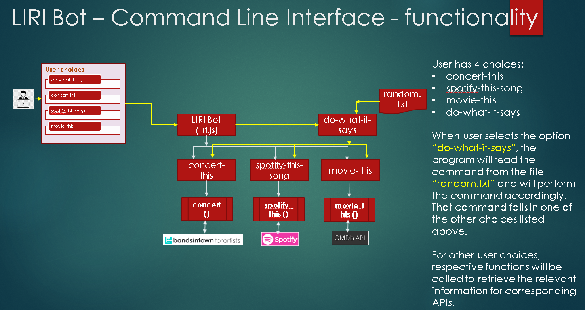
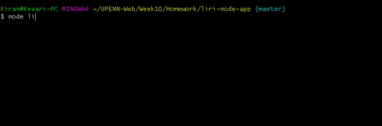
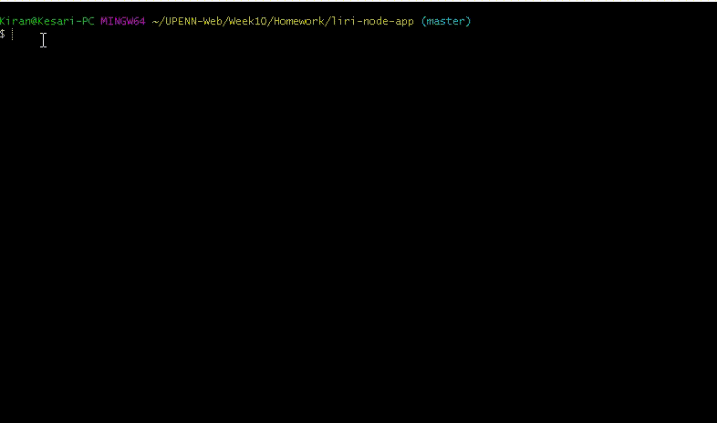
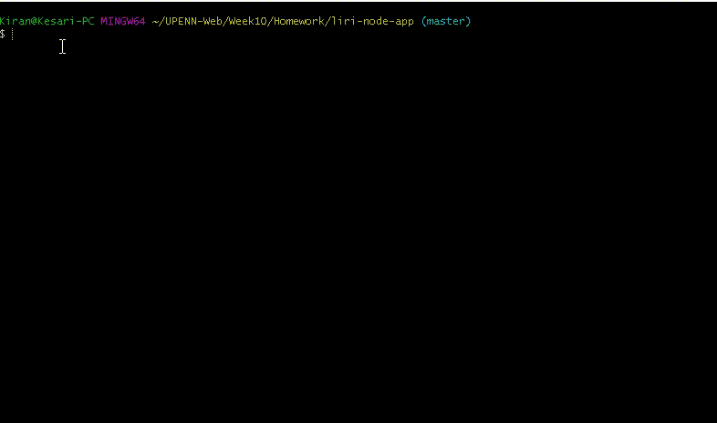
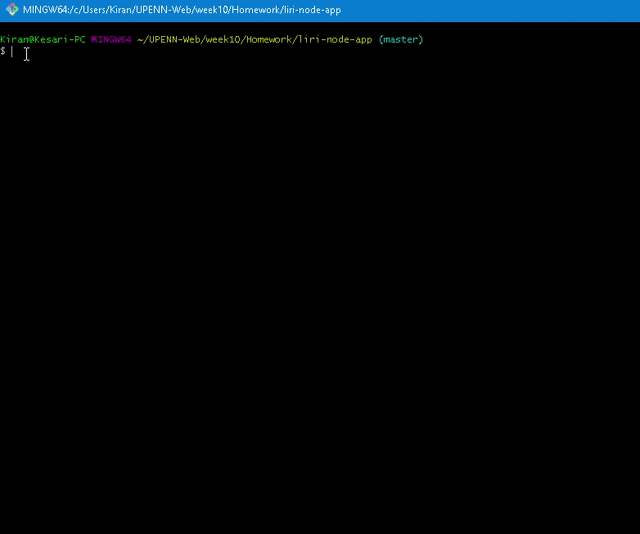

# LIRI Bot
LIRI Bot is a command line interface (CLI) application developed using node.js which accepts user provided commands and displays the relevant information on the screen.
 

### Overview and flow:
The picture below shows the overall flow of the process and the list of acceptable user choices.
 

 

### Technologies used:
LIRI Bot node application uses the below listed technologies to function.
#### Dependencies on external APIs:
-  Node-Spotify-API
-  Bands In Town API
-  OMDB API

 

#### JavaScript node Libraries
-  Axios
-  Moment
-  DotEnv

### How to run the liri node application:

#### liri.js concert-this:

When the user inputs the choice as <u><b>"concert-this"</b></u>, the LIRI Bot will search the Bands in Town Artist Events API for an artist or band name and will provide the below information on the screen:

-  Name of the venue
-  Venue location
-  Date of the Event (use moment to format this as "MM/DD/YYYY")

If user has not provided any artist or band name as a parameter, a message will be displayed on the screen mentioning user to provide one.
 
A detailed list of actions on how to use this option is shown below as a reference.

#### liri.js spotify-this-song:

When the user inputs the choice as <u><b>"spotify-this-song"</b></u>, the LIRI Bot will utilize the node-spotify-api package in order to retrieve song information from the Spotify API and will provide the below information on the screen:

-  Artist(s)
-  The song's name
-  A preview link of the song from Spotify
-  The album that the song is from

If user has not provided any song name as a parameter, information of a defaulted song “Sign of the times” will be provided.
 
A detailed list of actions on how to use this option is shown below as a reference.

#### liri.js movie-this:

When the user inputs the choice as <u><b>"movie-this"</b></u>, the LIRI Bot will retrieve data from the OMDB API and will provide the below information on the screen:

-  Title of the movie.
-  Year the movie came out.
-  IMDB Rating of the movie.
-  Rotten Tomatoes Rating of the movie.
-  Country where the movie was produced.
-  Language of the movie.
-  Plot of the movie.
-  Actors in the movie.

If user has not provided any movie name as a parameter, information of a defaulted movie "Mr. Nobody" will be provided.
 
A detailed list of actions on how to use this option is shown below as a reference.

#### liri.js do-what-it-says:

When the user inputs the choice as <u><b>"do-what-it-says"</b></u>, the LIRI Bot will look at the text provided in the <u>"random.txt"</u> file, which is a comma separated file that holds
a specific command to be executed along with its parameter.

Any changes made to the text inside the random.txt, the LIRI Bot will execute the new command listed in the random.txt file.
 
A detailed list of actions on how to use this option is shown below as a reference. Refer to the full video here : path - "/assets/do-what-it-says.mp4"

### Link to the powerpoint below

[LIRI Bot functionality - Powerpoint](LIRI_Bot_functionality.pptx)

- Developed by : <b> Kiran Kesari </b> 